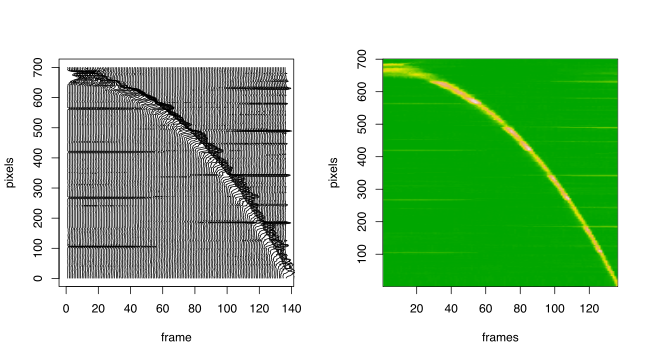

# Un experimento de caída libre
date: "2018-12-08 22:42"


Para mi curso de "Data Science" trato de usar datos realistas. Es difícil hacer experimentos biológicos en clases, ya que requieren mucho tiempo. Por eso prefiero hacer experimentos de física. La semana pasada hice uno de esos experimentos, para generar datos que los alumnos analizarán después.

Con un poco de HTML y JavaScript hice una página web con un cronómetro y una escala de distancias. El cronómetro se controla con el teclado o con las flechas del puntero laser. Los alumnos usaron sus teléfonos celulares para grabar un video de una pelota cayendo. Yo también hice mi video, y [lo subí a YouTube](https://youtu.be/4pkAFmGZ6_M). Se puede ver acá:

<iframe width="560" height="315" src="https://www.youtube.com/embed/4pkAFmGZ6_M" frameborder="0" allow="accelerometer; autoplay; encrypted-media; gyroscope; picture-in-picture" allowfullscreen></iframe>

Mi video comienza a velocidad normal por un par de segundos, y luego graba en cámara lenta. El video de YouTube se puede reproducir a un cuarto de la velocidad normal, lo que permite ver y anotar cuándo la pelota cruza las marcas de la escalera. El reloj no funcionó como yo esperaba, probablemente porque olvidé cerrar los otros procesos en el computador. Una alternativa para la próxima vez es usar un display externo controlado por un Arduino.

# Extrayendo la parte interesante
Pero no todo está perdido. En teoría el video se graba a una velocidad constante, por lo que se puede usar el mismo video como reloj. Siguiendo una receta que [encontré en internet](https://www.bugcodemaster.com/article/extract-images-frame-frame-video-file-using-ffmpeg), usé `FFMPEG` para crear una imagen de cada frame. La información interesante que entrega `FFMPEG` es:

```
Metadata:
  major_brand     : qt
  creation_time   : 2018-12-03T11:06:29.000000Z
  com.apple.quicktime.make: Apple
  com.apple.quicktime.model: iPhone SE
Duration: 00:00:12.14, start: 0.000000, bitrate: 8981 kb/s
  Stream #0:1(und): Video: h264 (High) (avc1 / 0x31637661),
  yuv420p(tv, bt709), 1280x720, 8792 kb/s,
  30 fps, 30 tbr, 600 tbn, 1200 tbc (default)
  encoder         : H.264
```

Con 30 frames/segundo por 12.14 segundos, se obtienen 365 archivos *jpg*. Revisando cuadro por cuadro decidí que lo más interesante sucede entre el frame 110 y el 245.

Para estudiar la caída, sólo se necesitan una columna de 40 o 50 pixeles de ancho. Para manipular imágenes se puede usar el programa `convert` de [_Imagemagik_](http://www.imagemagick.org/Usage/), que puede hacer muchísimas cosas desde la línea de comando. Por ejemplo el comando
```sh
convert frame0110.jpg -crop 40x700+310+20 col0110.jpg
```
genera una imagen de 40x700 pixeles, justo donde se mueve la pelota. Usando un ciclo `for` se puede hacer lo mismo para cada frame.
```sh
for i in `seq -w 365`
do
    convert frame0$i.jpg -crop 40x1100+310+20 col$i.jpg
done
```
Luego se junta todo usando el comando
```sh
convert col0???.jpg +append composite.jpg
```
y obtenemos esta imagen[^1], que ya parece decirnos algo:


# Aislando la imagen de la pelota


Ya que tenemos las herramientas, podemos usar el computador para medir la distancia de la pelota al borde superior en cada frame. Lo ideal es aislar la pelota y separarla del fondo. Para eso necesitamos una referencia del fondo. Como la mayoría de las veces la pelota no está en ningún punto fijo, podemos construir una "imagen de fondo" tomando la mediana de cada frame:
```sh
convert col0???.jpg -evaluate-sequence median bgr.jpg
```
La imagen resultante es borrosa, pues no usé un trípode. La próxima vez hay que usar trípode[^546ea9c3].

[^546ea9c3]: El programa `convert -evaluate-sequence median` indicó problemas de manejo de memoria, pero no fueron reproducibles. Repitiendo el comando eventualmente obtuve la imagen que muestro acá.

Ahora podemos aislar la pelota en cada frame, usando un ciclo `for` como este:
```sh
for i in $(seq -w 110 245)
do
  convert col$i.jpg bgr.jpg -compose minus -composite diff$i.jpg
done
convert diff*.jpg +append -negate composite-diff.jpg
```
y obtenemos esto:


Ahora podemos extraer el canal amarillo de cada archivo `diff*.jpg` y convertirlo a texto. Para esto usamos `convert` una vez más, y escogemos el formato PGM para la salida estándar. Hay 4 líneas de encabezado y luego una línea de texto por cada línea en la imagen. Usando `gawk` calculamos la mediana de cada línea.
```sh
for i in $(seq -w 110 245)
do
    convert diff$i.jpg -channel Y -separate -compress none \
        -depth 8 PGM:- | gawk 'NR>4 {split($0,b); asort(b,a); \
        print a[int(NF/2)]}' > median$i.txt
done
paste median*.txt > median.tsv
```
Ahora el archivo `median.tsv` contiene la intensidad de amarillo en cada línea de cada frame. Este archivo lo procesamos con R.

# Localización automática de la pelota
En R podemos leer [nuestros datos](median.tsv) y hacer un gráfico simple


```r
signal <- read.delim("median.tsv", header=FALSE)

frames <- 1:ncol(signal)
pixels <- 1:nrow(signal)

opar=par(mfrow=c(1,2))
plot(pixels, pixels, type="n", ylab="pixels", xlab="frame",
     xlim=range(frames))
for(i in frames) {
  lines(0.1*signal[[i]]+i, rev(pixels))
}
image(x=frames, y=pixels, z=t(signal)[,rev(pixels)],
      useRaster = TRUE, col = terrain.colors(200))
```



La matriz `signal` tiene una columna por cada frame y una fila por cada pixel en el eje vertical.

En principio podemos encontrar la localización de cada *peak* usando la función `which.max()` en cada columna, pero el resultado no es muy bueno.


```r
fall <- data.frame(frames,
    y = -apply(signal[30:700,], 2, which.max))
plot(y ~ frames, data=fall)
```


Podemos reducir el ruido tomando un filtro de mediana móvil. Ahora la localización de la pelota se vé mucho mejor.


```r
clean_signal <- sapply(frames, function(i) runmed(signal[[i]], k=11))
fall$px <- -apply(clean_signal[30:700,], 2, which.max)
plot(px ~ frames, data=fall)
model_px <- lm(px ~ frames + I(frames^2), data=fall)
lines(predict(model_px), col="red", lwd=2)
```


y obtenemos un buen ajuste a un modelo polinomial de segundo grado


```r
summary(model_px)
```

```

Call:
lm(formula = px ~ frames + I(frames^2), data = fall)

Residuals:
    Min      1Q  Median      3Q     Max 
-11.123  -3.348   0.558   3.408   8.296 

Coefficients:
             Estimate Std. Error t value Pr(>|t|)    
(Intercept) -5.791967   1.207905   -4.80  4.3e-06 ***
frames       0.271828   0.040705    6.68  6.0e-10 ***
I(frames^2) -0.036823   0.000288 -127.94  < 2e-16 ***
---
Signif. codes:  0 '***' 0.001 '**' 0.01 '*' 0.05 '.' 0.1 ' ' 1

Residual standard error: 4.63 on 133 degrees of freedom
Multiple R-squared:  0.999,	Adjusted R-squared:  0.999 
F-statistic: 1.2e+05 on 2 and 133 DF,  p-value: <2e-16
```

Esta prueba de concepto está limitada por las unidades de medida. Tenemos pixeles por frame, y queremos metros por segundo. Necesitamos más información.

# ¿Cuánto dura cada frame?
En el video original, y en cada imagen de un frame completo, se puede ver el cronómetro. En teoría se puede usar OCR para obtener ese número. En la práctica es más fácil hacerlo "a mano", con la ayuda del computador.

Usando JavaScript hice [una página web](https://anaraven.github.io/free-fall/) que muestra cada frame uno por uno, y presenta un cuadro de entrada dónde se puede escribir el número que se lee en la foto. Si el número no cambia se puede dejar la entrada en blanco. El programa JavaScript colecta los datos y permite descargarlos al final. Obtuve el archivo [`read-20181208T0857.txt`](read-20181208T0857.txt), que podemos leer en R.


```r
f <- read.delim("read-20181208T0857.txt")
```
El archivo tiene tres columnas: *frame*, *file*, y *millisec*. Varias líneas tienen el campo *millisec* vacío, y las podemos eliminar. Tambien eliminamos las lineas duplicadas


```r
f <- subset(f, !is.na(millisec))
f <- subset(f, !duplicated(millisec))
plot(millisec ~ frame, f)
```


Se observa claramente que los primeros frames son a una velocidad distinta que los últimos. Para encontrar el punto exacto podemos evaluar la "derivada"


```r
plot(diff(f$millisec)/diff(f$frame))
abline(h=10)
```


Vemos que todos los primeros frames toman más de 10 milisegundos. Usamos ese valor como punto de corte.

```r
thr = min(f$frame[(diff(f$millisec)/diff(f$frame)) <10])
plot(diff(f$millisec)/diff(f$frame), type="n")
text(diff(f$millisec)/diff(f$frame), labels=f$frame, cex=0.5)
abline(v=which(f$frame==thr))
```


Esto quiere decir que el frame `thr=`31 es el primero en cámara lenta. Usamos ese limite para construir un modelo lineal.


```r
model_time <- lm(millisec~frame, f, subset=frame>=thr)
summary(model_time)
```

```

Call:
lm(formula = millisec ~ frame, data = f, subset = frame >= thr)

Residuals:
   Min     1Q Median     3Q    Max 
-16.68  -4.36  -0.12   7.37  13.12 

Coefficients:
            Estimate Std. Error t value Pr(>|t|)    
(Intercept) 1.79e+03   2.50e+00     717   <2e-16 ***
frame       4.17e+00   1.16e-02     359   <2e-16 ***
---
Signif. codes:  0 '***' 0.001 '**' 0.01 '*' 0.05 '.' 0.1 ' ' 1

Residual standard error: 8.28 on 52 degrees of freedom
Multiple R-squared:     1,	Adjusted R-squared:     1 
F-statistic: 1.29e+05 on 1 and 52 DF,  p-value: <2e-16
```

Es decir, cada frame tiene una duración de 4.168 milisegundos, en promedio. Más precistamente, la duración está en este intervalo.


```r
confint(model_time)
```

```
              2.5 %  97.5 %
(Intercept) 1789.45 1799.50
frame          4.14    4.19
```
En otras palabras el *frame rate* es

```r
1000/coef(model_time)["frame"]
```

```
frame 
  240 
```
frames por segundo. El valor nominal es de 240 cuadros por segundo.

Ahora podemos agregar una columna con el tiempo en milisegundos de cada frame. Para simplificar el siguiente análisis vamos a fijar el primer frame como tiempo 0.


```r
fall$time <- (fall$frames-1)*coef(model_time)["frame"]
```

# Midiendo la distancia vertical
Nuestro dato de distancia está expresado en *pixels*. Necesitamos convertirlo a metros. Primero vamos a medir la distancia entre cada banda de color blanco y negro. Graficamos la señal original del último frame, sin ningún filtro


```r
last_frame <- signal[ , ncol(signal)]
plot(last_frame, type="l")
abline(h=25)
```


Hay varios peaks equiespaciados (o casi). Estos corresponden a las transiciones entre los colores de las bandas. Si hubiese usado un trípode no se verían. En este caso el pequeño movimiento de la cámara es una ventaja. Tomando un corte al nivel 25, podemos agrupar los valores similares en unos pocos grupos.


```r
px <- which(last_frame>25 & last_frame<50)
hist(px, nclass=20, col="grey")
```


Vemos que hay 5 grupos naturales. Le asignamos una etiqueta a cada uno de ellos

```r
bar <- as.numeric(cut(px, 5))
plot(bar~px)
```


Esto quiere decir que la correlación entre pixels y barras es razonablemente lineal. El único dato extra que necesitamos es el tamaño de cada barra en centímetros. Esto no lo medí con cuidado, lo haré mejor la próxima vez. Una barra negra en el centro midió entre 18 y 19 centímetros. Los peaks de este modelo están cada dos barras, es decir, cada 36cm. Incorporamos ese dato en nuestro modelo de distancias.


```r
mtr <- bar*0.36
model_dist <- lm(mtr ~ px)
plot(mtr ~ px)
abline(model_dist)
```


```r
summary(model_dist)
```

```

Call:
lm(formula = mtr ~ px)

Residuals:
     Min       1Q   Median       3Q      Max 
-0.02020 -0.01577  0.00323  0.01247  0.02428 

Coefficients:
            Estimate Std. Error t value Pr(>|t|)    
(Intercept) 2.08e-01   8.10e-03    25.7  3.5e-13 ***
px          2.37e-03   1.93e-05   122.7  < 2e-16 ***
---
Signif. codes:  0 '***' 0.001 '**' 0.01 '*' 0.05 '.' 0.1 ' ' 1

Residual standard error: 0.0168 on 14 degrees of freedom
Multiple R-squared:  0.999,	Adjusted R-squared:  0.999 
F-statistic: 1.51e+04 on 1 and 14 DF,  p-value: <2e-16
```

Por lo tanto cada barra de approx. 19cm corresponde a

```r
0.19/coef(model_dist)["px"]
```

```
px 
80 
```
pixeles. El programa del cronómetro permite cambiar el tamaño de las barras en incrementos de 10 pixeles. Un tamaño de 80 pixeles por barra corresponde muy bien con esto.

# Modelo Final
Ahora estamos en condiciones de juntar todo. Agregamos una columna con la posición vertical en metros y otra con el tiempo en segundos. Para calcular el modelo polinomial de segundo grado, agregamos otra columna con el tiempo al cuadrado.


```r
fall$y_m <- predict(model_dist, newdata=data.frame(px=fall$y))
fall$t_sec <- fall$time/1000
fall$t_sec2 <- fall$t_sec^2
```
Ahora hacemos el modelo final. 

```r
model_final <- lm(y_m ~ t_sec + t_sec2, data=fall)
plot(y_m ~ t_sec, data=fall)
lines(predict(model_final, newdata=fall)~ t_sec, data=fall, col="red", lwd=2)
```


```r
summary(model_final)
```

```

Call:
lm(formula = y_m ~ t_sec + t_sec2, data = fall, subset = 10:126)

Residuals:
      Min        1Q    Median        3Q       Max 
-0.025493 -0.006779 -0.000409  0.006975  0.024526 

Coefficients:
            Estimate Std. Error t value Pr(>|t|)    
(Intercept)  0.18884    0.00416   45.36   <2e-16 ***
t_sec        0.08340    0.03394    2.46    0.016 *  
t_sec2      -4.93735    0.05928  -83.28   <2e-16 ***
---
Signif. codes:  0 '***' 0.001 '**' 0.01 '*' 0.05 '.' 0.1 ' ' 1

Residual standard error: 0.0114 on 114 degrees of freedom
Multiple R-squared:  0.999,	Adjusted R-squared:  0.999 
F-statistic: 6.77e+04 on 2 and 114 DF,  p-value: <2e-16
```

De acuerdo a esto, la aceleración de gravedad es $9.875m/s^2$.

```r
-2*coef(model_final)["t_sec2"]
```

```
t_sec2 
  9.87 
```

```r
-2*confint(model_final)["t_sec2",]
```

```
 2.5 % 97.5 % 
 10.11   9.64 
```
Un poco mucho. Sospecho que:

+ Hay que tener un mejor reloj
+ Hay que medir las distancias con más cuidado

El verdadero desafío es rehacer todo llevando la cuenta de los márgenes de error en cada paso.

[^1]: Para limitar la imagen a un tamaño razonable, se puede usar `convert $(seq -w 110 5 245 |sed 's/\(.*\)/col\1.jpg/') +append composite.jpg`
